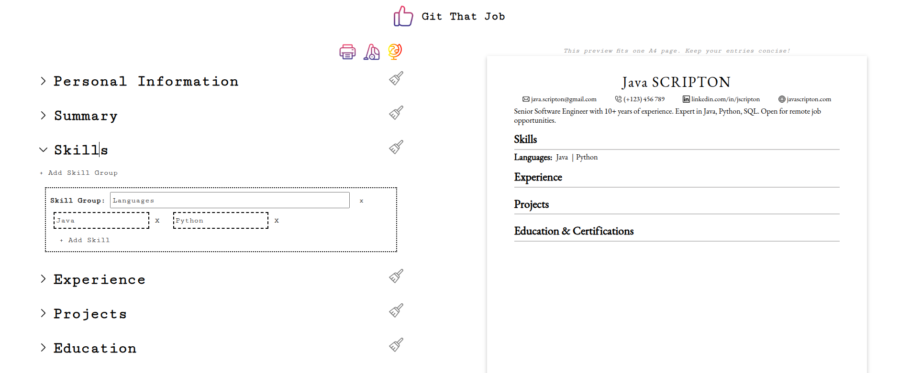

  
  <h1>Real-Time CV Builder with Instant PDF Export</h1>  

> **A bilingual CV creation tool that updates in real-time as you type, with one-click PDF download. Built for job seekers who need professional resumes fast.**

---

## 📋 Table of Contents
- [Live Demo](#-live-demo)
- [Key Features](#-key-features)
- [The Problem](#-the-problem)
- [The Solution](#-the-solution)
- [Tech Stack](#-tech-stack)
- [Future Enhancements](#-future-enhancements)

---

## 🎭 Live Demo

  
**Live App:** [gitthatjob.vercel.app](https://gitthatjob.vercel.app/)

**Try it yourself:**
1. Start typing your information in the form
2. Watch your CV update instantly in real-time
3. Switch between English/Spanish interfaces
4. Click "Print/Download" to save as PDF
   
---

## ✨ Key Features

- ⚡ **Real-time preview** - See changes instantly as you type
- 💾 **Auto-save** - Local storage keeps your work safe (even if you close the tab)
- 🌍 **Bilingual** - English/Spanish interface switching
- 📄 **Native PDF export** - Browser's print dialog for perfect formatting
- 🔒 **Privacy-first** - All data stays in your browser, no servers
- 📱 **Fully responsive** - Works on desktop, tablet, and mobile
- 🚫 **No registration** - Start building immediately

---

## 🔍 The Problem

Having gone through a career transition myself and supported friends in their job searches, I identified these pain points:

- Expensive CV builder subscriptions ($10-30/month)
- No immediate visual feedback while editing
- Language barriers for bilingual job seekers
- Poor PDF formatting from most free tools
- Fear of losing work due to accidental tab closes

---

## ✅ The Solution

A streamlined free-of-charge CV builder that prioritizes speed, simplicity, and user experience.

**Technical Decisions:**
- **window.print()** for PDF generation - leverages native browser capabilities for consistent, high-quality output
- **Local Storage API** - automatic data persistence
- **React hooks** - efficient state management for real-time updates

---

## 🛠 Tech Stack

### Frontend
- **React 18** - Component-based architecture with hooks for state management
- **CSS3** - Custom responsive styling with print media queries
- **react-hook-form** - Form validation and state management

### Key Features
- **Browser Print API (window.print())** - Native PDF generation with perfect formatting
- **Local Storage API** - Client-side data persistence
- **CSS Print Media Queries** - Professional document formatting for PDF export

---

## 🔮 Future Enhancements

The application is ready-to-use but I would still like to apply the following features:
- Multiple professional templates
- Additional languages (French, German, Portuguese, etc...)
- AI integration for bullet points generating

---
